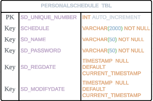

API명세서

| **기능**              | **메서드** | **엔드포인트**                | **요청 파라미터/바디**   | **응답**                 | **응답 코드** |
|-----------------------|------------|--------------------------|--------------------------|--------------------------|----------|
| **스케줄 생성**       | `POST`     | `/schedule/creates`      | 요청 바디: 등록 정보      | 등록된 스케줄 정보       | `200: 정상등록`  |
| **스케줄 단건 조회**  | `GET`      | `/schedule/search/{id}`  | 요청 파라미터: 스케줄 ID  | 단건 스케줄 정보         | `200: 정상조회`  |
| **스케줄 조회**       | `GET`      | `/schedule/search`       | 요청 파라미터: 이름, 수정 날짜 | 다건 스케줄 정보   | `200: 정상조회`    |
| **스케줄 수정**       | `PUT`      | `/schedule/modify/{id}`  | 요청 바디: 수정 정보      | 수정된 스케줄 정보       | `200: 정상수정`  |
| **스케줄 삭제**       | `DELETE`   | `/schedule/delete`       | 요청 파라미터: 스케줄 ID, 패스워드 | -              | `200: 정상삭제`  |


1. 일정 생성 API\
   URL: /schedule/creates\
   Method: POST\
   Request Body
 ```json
    {
    "schedule": "string",
    "sd_name": "string",
    "sd_password": "string"
    }
```
Response
 ```json
    {
      "sd_unique_number": "int",
      "schedule": "string",
      "sd_name": "string",
      "sd_password": "string",
      "sd_regDate": "yyyy-MM-dd'T'HH:mm:ss.SSSXXX",
      "sd_modifyDate": "yyyy-MM-dd'T'HH:mm:ss.SSSXXX"
    }
```

2. 일정 검색 API (ID로 검색)\
   URL: /schedule/search/{id}\
   Method: GET\
   Path Variable:\
   id: int - 일정의 고유 ID\
   Response
```json

   {
   "sd_unique_number": "int",
   "schedule": "string",
   "sd_name": "string",
   "sd_password": "string",
   "sd_regDate": "yyyy-MM-dd'T'HH:mm:ss.SSSXXX",
   "sd_modifyDate": "yyyy-MM-dd'T'HH:mm:ss.SSSXXX"
   }
```
3. 일정 검색 API (이름 또는 날짜로 검색)\
   URL: /schedule/search\
   Method: GET\
   Request Params:\
   name: string (optional) - 일정 이름\
   modifyUpdate: yyyy-MM-dd (optional) - 수정일자\
   Response
```json
   [
       {
       "sd_unique_number": "int",
       "schedule": "string",
       "sd_name": "string",
       "sd_password": "string",
       "sd_regDate": "yyyy-MM-dd'T'HH:mm:ss.SSSXXX",
       "sd_modifyDate": "yyyy-MM-dd'T'HH:mm:ss.SSSXXX"
       }
   ]
```
4. 일정 수정 API\
   URL: /schedule/modify/{id}\
   Method: PUT\
   Path Variable:\
   id: int - 수정할 일정의 ID\
   Request Body
```json
    {
      "id" : "int",
      "schedule": "string",
      "sd_name": "string",
      "sd_password": "string"
    }
```
Response:
```json
    {
        "sd_unique_number": "int",
        "schedule": "string",
        "sd_name": "string",
        "sd_password": "string",
        "sd_regDate": "yyyy-MM-dd'T'HH:mm:ss.SSSXXX",
        "sd_modifyDate": "yyyy-MM-dd'T'HH:mm:ss.SSSXXX"
    }
```
5. 일정 삭제 API\
   URL: /schedule/delete\
   Method: DELETE\
   Request Params:\
   id: int - 삭제할 일정의 ID\
   password: string - 일정의 비밀번호\
   Response: void\
   설명: 주어진 ID와 비밀번호가 일치하는 일정을 삭제합니다.